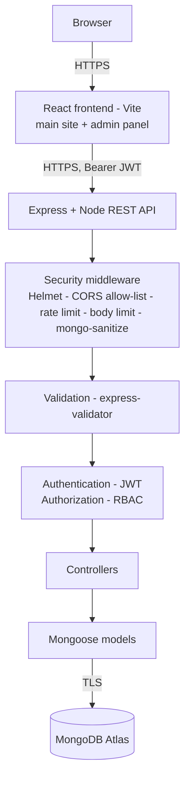

# RescuePaws – Security Documentation (Checkpoint 2)

## 1. System architecture



React never talks to MongoDB. The database connection string exists only on the server.

## 2. MERN data flow

`React → Express route → middleware (rate limit → auth → RBAC → validation) → controller → Mongoose model → MongoDB → response → React UI`

Example – approving a sighting: the admin panel sends `PATCH /api/sightings/:id/moderate` with the JWT → `protect` verifies the
token and loads the user's roles → `authorize("admin")` → validator checks the id and the allowed status → controller updates the
document, notifies the reporter and writes an audit-log entry → JSON response.

## 3. Database design (MongoDB, 6 collections)

| Collection | Key fields | Relationships / constraints |
|---|---|---|
| **users** | name, email (unique), phone, roles[], password (bcrypt hash, `select:false`), termsAccepted | – |
| **sightings** | animalType, approximateSize, location, condition, moderationStatus, rescueStatus, postStatus, likes[] | `reportedBy → users` (required) |
| **adoptionposts** | petName, animalType, gender, location, listingStatus, moderationStatus, reviewNote | `owner → users` (required) |
| **adoptionapplications** | applicant details, status (`Needs Review`/`Approved`/`Rejected`) | `post → adoptionposts`, `applicant → users`; **unique (post, applicant)** |
| **notifications** | category, title, message, isRead | `user → users` |
| **auditlogs** | action, outcome, actor, actorRoles, ip, userAgent | `actor → users` |

Required fields, enums, `maxlength` limits and unique indexes are defined in the schemas (`models/`).

## 4. RBAC matrix

Roles: **Admin** (full management), **Reporter** (reports strays, posts pets for adoption), **Adopter** (applies to adopt).
A user may hold Reporter + Adopter together (the default at sign-up); permissions are the union. Anonymous visitors can only read the public feeds.

| Function | Admin | Reporter | Adopter |
|---|:-:|:-:|:-:|
| View public sightings / adoption feeds | ✓ | ✓ | ✓ |
| Report a sighting | ✓ | ✓ | ✗ |
| Edit a sighting | ✓ any | own only | ✗ |
| Delete a sighting | ✓ any | own only | ✗ |
| Moderate sightings (approve / reject / rescued), set public status badge | ✓ | ✗ | ✗ |
| Like a sighting | ✓ | ✓ | ✓ |
| Create an adoption listing (regular users' listings wait for admin approval) | ✓ auto-approved | ✓ pending | ✗ |
| Edit / delete an adoption listing | ✓ any | own only | ✗ |
| Approve / reject adoption listings (only approved listings are public) | ✓ | ✗ | ✗ |
| Mark a listing "Adopted" | ✓ | ✗ | ✗ |
| Submit an adoption application (approved listings only) | ✗ | ✗ | ✓ |
| View / withdraw own applications (withdraw only while under review) | – | – | ✓ |
| View applications for a listing | ✓ | own listing | ✗ |
| Review (approve / reject) applications | ✓ | ✗ | ✗ |
| Manage users and roles, view audit logs and statistics (admin dashboard) | ✓ | ✗ | ✗ |
| Own profile, password change, notifications | ✓ | ✓ | ✓ |

Unauthorized actions return **403 Forbidden** (and are recorded in the audit log). **Least privilege:** each role gets only what it needs
(e.g. reporters cannot moderate, adopters cannot post sightings); admins cannot change or delete their own account through the API (prevents lock-out); "admin" can never be self-assigned.

## 5. Authentication mechanism

- Login (`POST /api/auth/login`) verifies the password with `bcrypt.compare` and returns a **signed JWT** (HS256) using `JWT_SECRET`.
- The token has an **expiration** (`JWT_EXPIRES_IN`, default 1 day) and contains **only** `{ id, iat, exp }` – no roles or personal data.
- On every protected request `protect` **verifies** the signature/expiry (algorithm pinned to HS256, so `alg: none` tokens are rejected), then loads the user from the database. Roles therefore come from the database on every request: a role change or account deletion takes effect immediately.
- Responses: no token → **401**; expired → **401**; invalid/tampered → **403**; token of a deleted account → **401**.
- Login gives the same message for "unknown email" and "wrong password", and does a dummy hash comparison for unknown emails (no user enumeration, including by timing).
- Logout: JWTs are stateless, so the client discards the token; `POST /api/auth/logout` records the event in the audit log.

## 6. Password hashing

Passwords are **never stored in plaintext**. `models/User.js` hashes them in a `pre("save")` hook with **bcrypt, cost 12** (`bcryptjs`); the hash is `select:false`
and removed from every JSON output. Login uses `bcrypt.compare`. Password policy (server-side): 8–72 characters (bcrypt's limit) with a lowercase letter, an uppercase letter and a number.
Verify in MongoDB: the `password` field starts with `$2a$12$…`.

## 7. Input validation

External input is treated as untrusted (`validators/` + `middleware/validate.js`). Invalid data gets **400** before it reaches a controller or the database.
- Types, trimming and length limits on every field; allow-lists (`isIn`) for enumerated values (animal type, condition, statuses, roles, filters).
- `:id` parameters must be valid MongoDB ObjectIds; `page`/`limit` are bounded; `spottedAt` cannot be in the future.
- Photo URLs must be `http(s)` URLs or site-relative paths (no `javascript:` / `data:`).
- Controllers read `matchedData(req)` – only validated fields – so extra fields (e.g. `roles: ["admin"]`) never reach the database (**mass-assignment protection**).
- NoSQL injection: `express-mongo-sanitize` strips `$`/`.` keys, validators reject non-string values, and login also uses Mongoose `sanitizeFilter`.
- Validation errors return `{ path, msg }` only – the submitted value (which could be a password) is not echoed back.

## 8. API security controls (all 8 controls listed in the guidelines are implemented; the minimum is 4)

| Control | Where |
|---|---|
| Authentication middleware | `middleware/auth.js` → `protect` |
| RBAC middleware | `authorize(...roles)` + ownership checks in controllers |
| Input & request validation | `validators/*`, `validate.js`, JSON body limit 10 kb |
| Rate limiting | global 300 req/15 min per IP; login: 10 **failed** attempts/15 min; register: 10/hour |
| Secure error handling | `middleware/errorHandler.js` – generic message, no stack/Mongo/paths; details only in server logs |
| Audit logging | `auditlogs` collection: register, login success/failure, logout, invalid tokens, permission denials, create/update/delete, moderation, reviews, role changes |
| Token expiration | `JWT_EXPIRES_IN` |
| Secure HTTP headers | Helmet (CSP, HSTS, `X-Content-Type-Options`, frame protection, hides `X-Powered-By`) |
| CORS allow-list | only `CLIENT_URL` and `ADMIN_CLIENT_URL` |

Error format (matches the guideline example, plus the fields the current frontends read):

```json
{ "message": "Unable to process request", "data": null, "error": { "message": "Unable to process request" } }
```

Privacy: public feeds never include reporter phone numbers, emails or full names (`Anna R.`); drafts, unapproved and rejected sightings
are visible only to their reporter and admins; a regular user's edit sends an approved sighting back to moderation.

## 9. Environment variables & secrets

`MONGODB_URI`, `JWT_SECRET`, `PORT` (and the optional ones in the README) are read from the environment (`config/env.js`).
Nothing sensitive is hard-coded. `.env` is in `.gitignore`; `.env.example` is provided. The server refuses to start without the required variables,
and in production refuses a `JWT_SECRET` shorter than 32 characters.

## 10. HTTPS / encryption in transit

Production hosts (Render, Vercel, Netlify, Atlas) terminate TLS, so the frontend, API and database are reached over HTTPS/TLS only. The API sends
`Strict-Transport-Security` (Helmet) and trusts the proxy header in production so client IPs and rate limits are correct.
To demonstrate: open the deployed site in the browser and show the padlock; in DevTools → Network show that the `login` request URL starts with `https://`
and that the `Authorization` header is only sent to the `https://` API; show that no MongoDB URI appears anywhere in the frontend bundle.
(The frontend must use the deployed `https://` API URL – see README → Deploying.)

## 11. Database security

- MongoDB Atlas with authentication enabled (`mongodb+srv://` connection, TLS).
- A dedicated **application database user** with `readWrite` on the application database only – no Atlas admin / `atlasAdmin` role (least privilege).
- Atlas Network Access list limited to the hosting provider's addresses where possible.
- Credentials only in environment variables on the host; never in Git or the frontend.
- Take screenshots of: Database Access (user + role), Network Access, and the `users` collection showing hashed passwords – these are the "MongoDB configuration evidence".

## 12. Security testing

Run `npm run test:security` **against your own deployed API** (see README) and paste the resulting table here. Expected results:

| Test | Expected Result | Actual Result | Status |
|---|---|---|---|
| Invalid registration data | 400 Bad Request | _run the script_ | |
| Invalid login | 401 Unauthorized | | |
| Access admin route as User | 403 Forbidden | | |
| Missing JWT | 401 Unauthorized | | |
| Invalid JWT | 403 Forbidden | | |
| Unauthorized DELETE | 403 Forbidden | | |
| Invalid MongoDB ID | 400 Bad Request | | |
| Excessive login requests | Rate limited (429) | | |
| Privilege escalation at sign-up | 400 | | |
| NoSQL injection in login | 400 | | |
| Unapproved sighting hidden / phone hidden | 404 / no phone | | |
| Security headers / no stack traces | present / none | | |

## 13. Known limitations (be upfront about these in the demo)

- **Token storage:** the frontends keep the JWT in `localStorage` (readable by injected scripts if an XSS bug existed). React escapes output and Helmet sets a CSP on the API, but an `HttpOnly` cookie would be stronger.
- **Admin hand-off:** the main site passes the admin's token to the admin app in the URL (`?token=`). The admin app removes it from the address bar, but it can still reach browser history/logs. Prefer logging in directly on the admin app.
- **Forgot password:** there is no server-side reset yet (needs an email service). The current "Forgot password" dialog in `Login.jsx` is client-only and does not change real passwords.
- **Image upload:** photos are stored as URLs; there is no file-upload endpoint.
- **Stateless logout:** a stolen token stays valid until it expires (default 1 day) unless the account is deleted; lower `JWT_EXPIRES_IN` for more safety.
